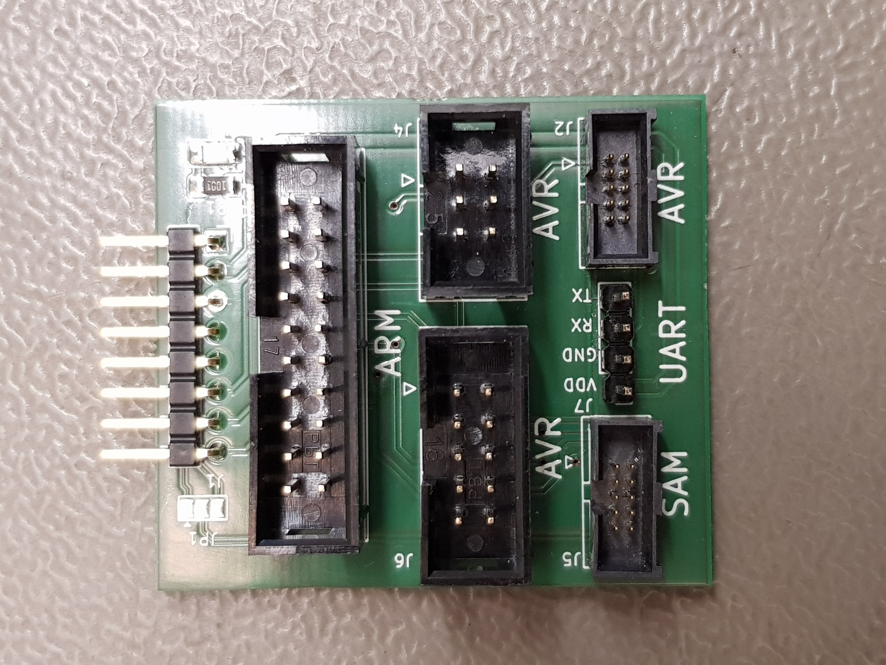

# PicKitUP

AVR &amp; SAM Adapter for Pickit4/SNAP

 
=
Just a simple adapter board to connect most common AVR and SAM ICSP Ports to the Microchip Pickit4/SNAP Programmer

=

If you Like this Project you can donate to the KiCad Project :  
